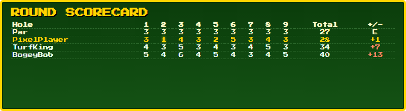

# Par 3 - Twitch Chat Mini-Game

A local OBS Browser Source mini-game. Viewers type `!join` in chat to enter a
60-second lobby; when it closes, each queued player plays a 9-hole round of
golf (one animated swing per hole, random stroke result from Hole in One to
Triple Bogey), one player at a time, and a final scorecard is shown at the
end. Stats persist between streams.



> Looking for design notes, bug postmortems, or test logs instead? See
> [DEVELOPMENT.md](DEVELOPMENT.md).

## What's in this folder

| File/Folder | What it is |
|---|---|
| `index.html` | The game itself. Add this as an OBS Browser Source. |
| `config.js` | Your Twitch channel name. Edit this before running. |
| `server.py` | Local backend that stores stats. Run this alongside OBS. |
| `server.exe` | Optional pre-built version of `server.py` - no Python required (see below). |
| `demo/index.html` | Self-contained demo build - no backend, no setup, fake data. |
| `StreamData/` | Created automatically - holds `par3_stats.json`. |

## 1. Set your Twitch channel

Open `config.js` in any text editor and change the channel name:

```js
const GAME_CONFIG = {
  channel: "YourChannelNameHere"
};
```

No other code changes are needed to point the game at your channel.

## 2. Run the backend

The backend stores player stats and serves them to the game. Pick one:

**Option A - Python installed:**
```
python server.py
```

**Option B - no Python (Windows):**
```
server.exe
```

Either way, leave the console window running while you stream - it's the
server. Closing it stops stats from loading/saving (the game itself keeps
working, it just won't remember scores). On first run it automatically
creates a `StreamData\par3_stats.json` file next to itself - you don't need
to create any folders yourself.

Default port is `5000`. To use a different port:
```
python server.py --port 6000
```
If you change the port, also edit the `API_BASE` constant near the top of
`index.html`'s `<script>` block to match (e.g. `http://localhost:6000`) -
this isn't automatic.

## 3. Add it to OBS

1. In OBS, add a **Browser Source**.
2. Point it at the local `index.html` file (check "Local file").
3. Background is already transparent - no chroma key needed.

## Chat commands

| Command | Who | Effect |
|---|---|---|
| `!join` | anyone | Joins the queue; opens the lobby if it's the first join of a cycle |
| `!stats` | anyone | Shows the requester's own stats on screen for a few seconds (rounds played, average score, hole-in-ones). Only works when idle. |
| `!resetpar3` | broadcaster only | Wipes all saved stats |

## Testing without Twitch chat

Open `index.html?dev=1` in a browser (or click the small **`dev`** button in
the top-left corner) to get a Dev Console panel with buttons to simulate
`!join`, flood the lobby with random players, and trigger `!resetpar3` -
without needing a live Twitch connection. Click **Connect to Twitch Chat**
from inside dev mode to test against real chat while keeping the simulator
panel visible. Drop `?dev=1` (or toggle `dev` off) to go fully live.

## Demo build (no backend, no setup)

`demo/index.html` is a self-contained copy for showing the game off without
running `server.py`/`server.exe` at all - open it directly in a browser, or
host it anywhere static (GitHub Pages, etc.). It always runs in dev mode with
seeded example stats that reset on reload.

## Building `server.exe` yourself

If you'd rather build the standalone exe than use the one included here:
```
pip install pyinstaller
pyinstaller --onefile --name server server.py
```
Move the resulting `server.exe` from `dist/` to the project root, next to
`index.html`.

## Notes

- A full 9-hole round takes roughly 30 seconds per player - worth keeping in
  mind for how many players you want joining per lobby window.
- The whole folder is portable - copy it (including `StreamData/` if you
  want to keep existing stats) to another machine or a USB drive and it
  works as-is.
