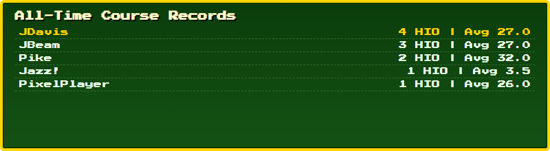
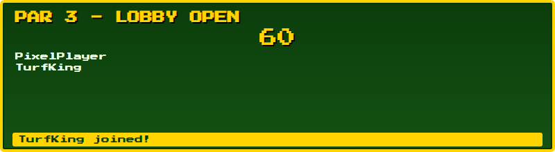
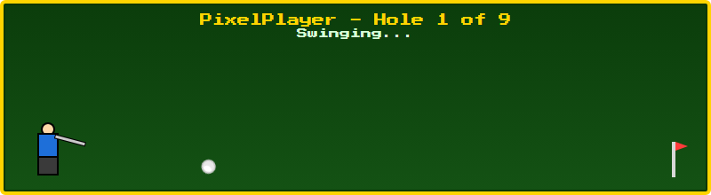

# Par 3 - Twitch Chat Mini-Game

A local OBS Browser Source mini-game for channel **PaladinArcade**. Viewers type
`!join` to enter a 60-second lobby; when it closes, each queued player plays
a 9-hole round (one animated swing per hole, random 1-6 "stroke" result each
time: Hole in One -> Triple Bogey), players go one at a time, and the round
is saved to a local stats file with a final scorecard shown at the end.


## Architecture

| Piece | What it is |
|---|---|
| `index.html` | Single-file frontend (HTML/CSS/vanilla JS). Transparent background, runs as an OBS Browser Source. |
| `server.py` | Zero-dependency Python `http.server` backend on `http://localhost:5000`. Persists stats to `StreamData\par3_stats.json` next to itself. Can be packaged as a standalone `server.exe` - see "Portable / standalone exe" below. |

Frontend <-> backend: `fetch()` calls to `GET /load_stats` and `POST /save_stats`.
Frontend <-> Twitch: [ComfyJS](https://github.com/instafluff/ComfyJS) (CDN), anonymous/read-only chat connection - no OAuth token required.

## Configuration (`config.js`)

The Twitch channel isn't hardcoded - it lives in `config.js`, next to
`index.html`:
```js
const GAME_CONFIG = {
  channel: "PaladinArcade"
};
```
Edit the `channel` value (any text editor) to point this at a different
Twitch channel - no need to touch `index.html` at all. Loaded via
`<script src="config.js">` rather than `fetch()`-ing a `.json` file: browsers
block `fetch()` of local files opened as `file://` (which is how OBS/you open
`index.html`), but a plain `<script src>` tag isn't subject to that
restriction - confirmed empirically (a `fetch('./config.json')` from a
`file://` page throws `URL scheme "file" is not supported"`, while
`<script src="config.js">` loads cleanly). So `config.js` is JSON-*shaped*
(one object, edit the string in quotes) but has to be `.js`, not `.json`, to
actually work here.

If you want a **different port**, see "Running it" below - `API_BASE` near
the top of `index.html`'s `<script>` block also needs to match by hand (it's
not in `config.js`, since the frontend can't discover the backend's port on
its own before it's talked to it).

### State machine

`IDLE -> LOBBY -> PLAYING -> RESULTS -> IDLE`

- **IDLE** - cycles every 6s between a pulsing "Type !join to play Par 3!" prompt and the All-Time Course Records (top 5 by `holeInOnes`, tie-broken by lowest average score).

  
  
- **LOBBY** - opened by the first `!join`. 60s countdown; usernames queue (de-duped); toast shows a returning player's historical average.

  
- **PLAYING** - timer hits 0, queue locks (`!join` ignored). Players go **one at a time**; each plays a full **9-hole round**: golfer sprite swings, ball rolls toward the flag (~1.6s), then a splash shows that hole's result (e.g. "HOLE 3: BOGEY (4 STROKES)", ~1.5s) before moving to the next hole. `#turnInfo` always shows whose shot it is and which hole (`PlayerName - Hole 3 of 9`). Once a player finishes hole 9, the next player in the queue starts their own 9 holes. Roughly 3.1s/hole -> ~28s per player.

  
- **RESULTS** - after every player's 9 holes are done, stats are updated and POSTed to the backend, then this state cycles every 6s (`RESULTS_CYCLE_MS`) between two views for `SCORECARD_SECONDS` (24s) total before returning to IDLE:
  - **Round Scorecard** - a real golf scorecard layout: a `Hole` header row (1-9, Total, +/-), a `Par` row (3 per hole, 27 total, `E`), then one row per player sorted by lowest total, each with a `+/-` to par (`E` / `-N` / `+N`, tinted blue under par / orange over), and gold-highlighted cells for any Hole in One. (See the scorecard screenshot at the top of this README.)
  - **All-Time Course Records** - the same top-5 leaderboard shown in IDLE's Hall of Fame, so the freshly-finished round's result is visible right alongside the all-time stats.

`isLobbyOpen` / `isPlaying` flags gate command handling so chat commands can't jump the state machine out of order. Note `isPlaying` stays true for the *entire* multi-player, 9-hole sequence - `!join` stays locked out until the whole round (every queued player, all 9 holes) finishes.

## Data format (`par3_stats.json`)

```json
{
  "PixelPlayer": {
    "totalRounds": 4,
    "totalStrokes": 99,
    "holeInOnes": 3
  }
}
```

A "round" is one full 9-hole playthrough, so `totalStrokes` sums all 9 holes
for each round played (par for 9 holes is 27), and `holeInOnes` sums across
all holes across all rounds. Average score (`totalStrokes / totalRounds`) is
derived on read, not stored - it's now a "strokes per 9-hole round" average
rather than a per-hole average.

## Running it

1. `python server.py` (leave running - creates a `StreamData\par3_stats.json` folder next to the script if missing) - or run `server.exe` instead, see below.
   - Custom port: `python server.py --port 6000` (default `5000`). If you use this, also change `API_BASE` near the top of `index.html`'s `<script>` block to match (`http://localhost:6000`) - the two aren't auto-synced, see "Configuration" above for why.
2. Add `index.html` as an OBS **Browser Source** (local file, transparent background already handled).

## Portable / standalone exe

`server.py` has zero external dependencies, so it packages cleanly into a
single `server.exe` with [PyInstaller](https://pyinstaller.org) - no Python
install needed on the machine you run it on.

**Build it:**
```
pip install pyinstaller
pyinstaller --onefile --name server server.py
```
This creates `server.exe` (plus `build/` and a `.spec` file you can delete -
only the exe matters). Move `server.exe` to the project root, next to
`index.html`.

**Why it's portable:** `server.py`/`server.exe` resolves its stats folder
relative to *itself* (`os.path.dirname(sys.executable)` when frozen, the
script's own folder otherwise) - not a hardcoded `C:\StreamData` path. So
copying the whole folder...
```
Par3-Mini-Game/
  index.html
  server.exe
  StreamData/par3_stats.json   (created on first run if missing)
```
...to a USB drive or another machine and running `server.exe` there just
works, and any existing `StreamData\par3_stats.json` you copy alongside it
travels with the setup instead of being left behind.

**On the new machine:** run `server.exe` (a console window stays open - that's
normal, it's the log; closing it stops the server), then open `index.html` in
OBS or a browser exactly as before. No Python, no `pip install`, nothing else
to set up.

Verified: built and ran `server.exe` standalone, confirmed `GET /load_stats` /
`POST /save_stats` / CORS preflight all behave identically to `python
server.py`, and that it correctly reads/writes `StreamData\par3_stats.json`
sitting next to the exe rather than `C:\StreamData`. `--port` works
identically on the exe too (`server.exe --port 6000`) - confirmed by binding
a custom port and hitting it with `curl`.

## Demo build (no backend needed)

`demo/index.html` is a self-contained copy for showing the game off without
running `server.py` at all - drop it on any static file host (a plain
`python -m http.server`, GitHub Pages, etc.) with zero setup. Differences
from the real `index.html`:
- **Dev mode is always on** (no `?dev=1` needed) - the Dev Console simulator is
  always visible, and it never auto-connects to Twitch (click **Connect to
  Twitch Chat** yourself if you want to demo that part too).
- **Stats are in-memory only**, seeded with a few example players so the Hall
  of Fame/scorecard aren't empty on first load - no `fetch()`, no disk, no
  server; everything resets on page reload.

Verified: loaded both via `file://` and via a real `python -m http.server` -
zero requests ever reach `localhost:5000` (confirmed by logging every network
request the page makes), zero console errors, and the seeded leaderboard
renders correctly in both cases.

## Dev Mode - testing without Twitch chat

You don't need a live Twitch connection to build/test this. Open `index.html`
directly in a browser (with `server.py` running) using either:

- `index.html?dev=1`, or
- the small **`dev`** button in the top-left corner (persists via `localStorage`, survives reloads/OBS restarts until toggled off)

This does two things:

1. **Skips auto-connecting to Twitch.** ComfyJS is *not* initialized automatically.
2. **Shows a Dev Console panel** (to the right of the stage) with:
   - A username + message field and **Send Chat Message** button
   - **Quick `!join`** and **Flood 5 Random Joins** (fills the lobby fast to test the countdown/results flow)
   - A broadcaster checkbox + **`!resetpar3`** button to test the reset command
   - A **Connect to Twitch Chat** button, for when you want to test against the real channel while still keeping the simulator panel visible

The key design point: both the real ComfyJS chat event and the dev simulator
call the **same** `onChatCommand(user, message, flags)` function
(`index.html`, search for "CHAT COMMAND ROUTER"). There is no separate mock
code path to drift out of sync - whatever you validate in dev mode behaves
identically live.

### Going live

Nothing to rewrite. Either:
- Drop `?dev=1` / turn the `dev` toggle off and reload - `index.html` connects to `ComfyJS.Init("PaladinArcade")` automatically on load, or
- While already in dev mode, click **Connect to Twitch Chat** to go live without losing the simulator panel (useful for a dry run with real chat before a stream).

## Text size & overflow scrolling

All on-screen text sizes come from five CSS custom properties defined once in
`index.html` (`:root`): `--fs-xs` (10px) through `--fs-xl` (26px). To resize
everything at once, edit those values rather than hunting down individual
`font-size` rules - every panel's text references one of the five.

Because the stage is a fixed 800x220 box (matching whatever size you set the
OBS Browser Source to), bigger text - or just a long lobby queue / a scorecard
with many players - can exceed that box. Rather than clip silently:
- Every `.panel` scrolls vertically on its own (`overflow-y: auto`) if its content is taller than the stage.
- `#scorecardWrap` additionally scrolls horizontally if the 12-column scorecard table is wider than the stage.

Verified by injecting a 16-player lobby and a 12-player scorecard directly and
confirming both `scrollHeight > clientHeight` (and could actually be scrolled
to reveal the rest of the list/table) rather than being cut off.

## Swapping CSS pixel art for real sprites

Three elements are wrapped and ready to swap for ``:
- `#golferSprite` (golfer figure - currently CSS-drawn head/body/legs/club divs inside `#golferWrap`; the `.club` element is what animates on `.swinging`)
- `#ballSprite` (golf ball, animates via `.rolling`)
- `#flagSprite` (pin/flag on the green)

Replace the CSS-only div(s) with an `` of the same id, or add one inside - the surrounding animation/positioning CSS targets the id/class, not the element type. If you swap in a real golfer sprite sheet with its own swing frames, you can drop the `swingClub` keyframe animation entirely and drive frame-stepping from `playSwingAnimation()` (`index.html`, "STATE 3: PLAY RESOLUTION") instead.

## Chat commands

| Command | Who | Effect |
|---|---|---|
| `!join` | anyone | Joins the queue; opens the lobby if it's the first join of a cycle |
| `!stats` | anyone | Shows the requester's own stats (rounds played, avg score, hole-in-ones) on screen for 6s, then reverts to the normal idle cycle. Only responds when idle (no lobby/round in progress) - typing it mid-round or mid-lobby is silently ignored. |
| `!resetpar3` | broadcaster only (`flags.broadcaster`) | Wipes all stats and saves the empty object |

Renamed from `!resetstats` to `!resetpar3` for consistency with Toad Royale's `!resettoad` (each game's reset command now names the game, avoiding any ambiguity about which game's stats a broadcaster is about to wipe).

## Status / next steps

- [x] Frontend state machine (Idle/Hall of Fame, Lobby, Playing, Final Scorecard)
- [x] Backend stats server (`load_stats` / `save_stats`, CORS)
- [x] Dev-mode chat simulator (no-Twitch testing path)
- [x] 9-hole-per-player round: golfer swing animation, per-hole stroke/hole splash, final golf-style scorecard (Hole/Par rows, +/- to par) cycling with All-Time Course Records
- [x] `!stats` - on-screen personal stats card, idle-only, auto-reverts after 6s
- [x] Twitch channel externalized to `config.js` (edit one file, no code changes)
- [x] `server.py --port` CLI option for running on a non-default port
- [x] Portable `server.exe` (rebuilt to include the `--port` option)
- [x] Self-contained `demo/index.html` - no backend, always dev mode, in-memory seeded stats
- [x] Full browser run-through via dev console covering the 9-hole flow and the RESULTS cycle - zero console errors, all states rendered correctly. See "Browser testing" below.
- [x] Real playtest against live PaladinArcade chat - confirmed working, real chatters accumulating real stats
- [ ] Optional: swap CSS pixel art for real golfer/ball/flag sprite images

## Browser testing

Verified with `server.py` running and `index.html?dev=1` driven headlessly
(Playwright/Chromium) end to end:

- Idle prompt pulses; Hall of Fame cycles in every 6s
- `Quick !join` opens the lobby and starts the 60s countdown
- Duplicate `!join` from the same username is correctly ignored
- `Flood 5 Random Joins` fills the scrolling lobby list, toasts show on each join
- Lobby timer expiring locks the queue and starts the 9-hole sequence
- Per player: `#turnInfo` correctly shows `Name - Hole X of 9`; golfer swings, ball rolls, and each hole's splash (e.g. "HOLE 1: TRIPLE BOGEY (6 STROKES)") shows the correct stroke count and golf term; next player starts automatically after the previous player's 9th hole
- Round Scorecard: Hole/Par header rows render correctly (`3 3 3 3 3 3 3 3 3 | 27 | E`), player row's Total and +/- to par matched the actual sum (e.g. 31 strokes -> `+4`), Hole in One cells highlighted gold, round winner's row highlighted gold
- RESULTS cycling: confirmed the scorecard view is shown first, flips to All-Time Course Records after ~6s, and the whole state returns to IDLE automatically once the hold time elapses
- `!resetpar3` (broadcaster-flagged, named `!resetstats` at the time of this specific test - see "Chat commands" for the rename) wiped the stats file back to `{}`; re-verified again after the rename with the same result
- No console errors at any point in any flow
- `!stats`: confirmed a player with existing stats (e.g. `totalRounds:1, totalStrokes:31` -> "Avg Score 31.0") renders correctly and auto-reverts to the idle cycle after 6s; a never-played username correctly shows "No rounds played yet"; typing `!stats` while a lobby is open is silently ignored (state stays `LOBBY`, no card shown)

### Chat commands not responding (fixed)

Real `!join`/`!resetstats` messages typed in actual Twitch chat did nothing,
even though the WebSocket connection and channel join both succeeded (verified
via raw IRC traffic - `SEND JOIN #paladinarcade`, confirmed by Twitch). Root
cause: **ComfyJS routes any message starting with `!` to a separate
`onCommand` handler, not `onChat`** (it strips the `!`, lowercases the word,
and calls `onCommand(user, command, message, flags)` instead). This game only
ever wired up `ComfyJS.onChat`, so every command-based message fell through to
ComfyJS's default no-op `onCommand` handler and never reached our game logic.

This went unnoticed through extensive dev-mode testing because the Dev
Console simulator calls `onChatCommand()` directly, bypassing ComfyJS
entirely - it never exercised the real onChat/onCommand routing.

Fixed in `connectTwitch()` (`index.html`) by also wiring `ComfyJS.onCommand`,
reconstructing `"!" + command` and funneling it through the same
`onChatCommand()` router `onChat` already used. Verified by simulating a real
IRC `PRIVMSG ... :!join` frame at the protocol level (bypassing the need for
an actual live chat message) and confirming it now correctly opens the lobby.

### Swing/ball direction fix

The golfer/ball were on the correct side originally (golfer left, flag right, ball meant to fly rightward), but the club's swing and the ball's flight were both starting at the same instant - so the club's backswing (which correctly moves *away* from the target, i.e. right-to-left) was visible at the exact moment the ball was already flying right, making the whole animation read as backwards. Fixed by:
- Re-timing `swingClub`'s keyframes so backswing (left) happens first, then impact/follow-through (right) - see `index.html`, `@keyframes swingClub`.
- Delaying `#ballSprite.rolling` (`animation-delay: 700ms`, `animation: rollBall 900ms`) so the ball only launches once the club sweeps forward through impact, not at the start of the backswing.

Verified frame-by-frame with screenshots at 150/450/800/1100ms: ball stays put through the backswing, then visibly launches right in sync with the club's forward swing.

A real Twitch chat connection was separately confirmed working end-to-end in OBS against live PaladinArcade chat, with real chatters accumulating real stats (see the `!join`/onCommand fix above - that's exactly the bug that was blocking it before this fix). Also note a full round takes a while to play out (~28s per player for 9 holes) - worth keeping in mind for how many players you want joining per lobby window during a stream segment.
